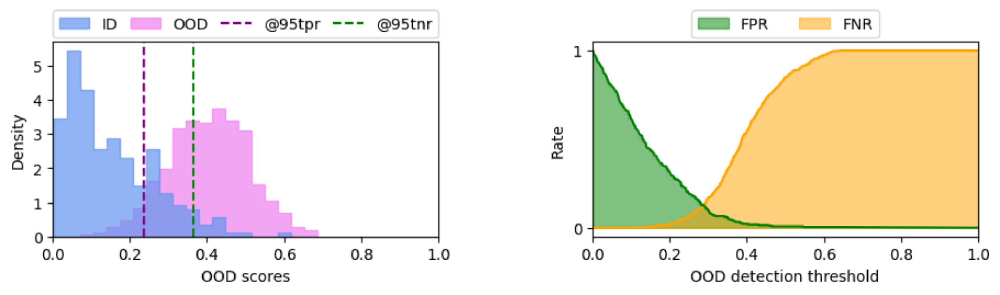

# beyond-AUROC
official code repository for the paper ["Beyond AUROC &amp; co. for evaluating out-of-distribution detection performance"](https://openaccess.thecvf.com/content/CVPR2023W/SAIAD/papers/Humblot-Renaux_Beyond_AUROC__Co._for_Evaluating_Out-of-Distribution_Detection_Performance_CVPRW_2023_paper.pdf) published in CVPRW'23

## Basic usage

```python
# Generate scores for ID and OOD samples
id_data = np.random.normal(0,0.2,500)
ood_data = np.random.normal(0.4,0.1,500)

# Compute OOD metrics and plot histogram + threshold curve for AUTC
plot_ood_scores(id_data,ood_data)
```
### output


```python
# standard metrics & thresholds
{'aupr-in': 0.9255299568160484,
 'aupr-out': 0.95080956515798,
 'auroc': 0.9427345454545454,
 'fnr@95tnr': 0.35432499454644867,
 'fpr@95tpr': 0.23636363636363636,
 'thresh_95tnr': 0.35657367889311314,
 'thresh_95tpr': 0.23418827631646175}
 
# ours
auFNR 0.6044, auFPR 0.1528
--> AUTC 0.3786
```

## Synthetic examples

The [Jupyter notebook](./imaginary%20models.ipynb) contains the code for reproducing the visualizations and OOD performance of the imaginary models in the paper (Figs. 1, 3, 4, 6, 7).

## BibTex

If you use this in your work, please cite our paper:

```
@INPROCEEDINGS{10208888,
  author={Humblot-Renaux, Galadrielle and Escalera, Sergio and Moeslund, Thomas B.},
  booktitle={2023 IEEE/CVF Conference on Computer Vision and Pattern Recognition Workshops (CVPRW)}, 
  title={Beyond AUROC & co. for evaluating out-of-distribution detection performance}, 
  year={2023},
  volume={},
  number={},
  pages={3881-3890},
  doi={10.1109/CVPRW59228.2023.00402}}
```
